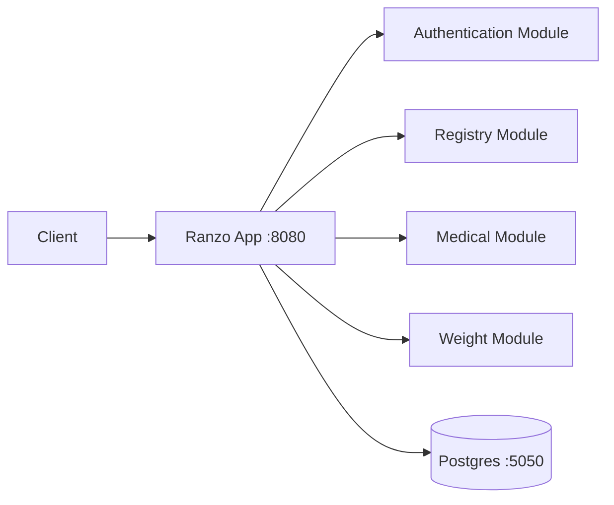

# Ranzo

Ranzo is a Java/Spring **modulith** backend for livestock management. The system runs as a single Spring Boot
application with clear module boundaries for authentication, animal registry, medical events/medication, and weight
records.

## Project Structure

- `ranzo`: Main Spring Boot modulith application (single deployable).
- `api-requests`: IntelliJ `.http` request collections.
- `integration-tests`: REST Assured + JUnit integration tests (legacy microservices era).
- `api-gateway` and other service folders: legacy microservices code (not used by the modulith app).

## Tech Stack

- Java 25
- Spring Boot 4.0.3
- Spring Modulith 2.0.3
- Spring Data JPA
- Spring Security + JWT (`jjwt`)
- Spring Web MVC
- PostgreSQL
- Maven (`mvnw`)

## High-Level Architecture



## Prerequisites

- JDK 25 installed and active (`java -version`)
- PostgreSQL reachable on `localhost:5050`
- Database credentials expected by the modulith app:
  - username: `user`
  - password: `secret`
  - database: `db`

## Environment and Configuration

### App port

- Ranzo modulith app: `8080` (default Spring Boot port)

### Database config (application.properties)

- `spring.datasource.url=jdbc:postgresql://localhost:5050/db`
- `spring.datasource.username=user`
- `spring.datasource.password=secret`

### JWT

- `jwt.secret` in `application.properties` (development-only default)

## Running Locally

```bash
cd ranzo
./mvnw spring-boot:run
```

## Authentication Flow

1. Register a user: `POST /auth/register`
2. Login: `POST /auth/login` to receive a JWT token.
3. Send `Authorization: Bearer <token>` when calling protected endpoints.
4. Validate token: `GET /auth/validate`

## API Overview

Base URL: `http://localhost:8080`

- `POST /auth/register`
- `POST /auth/login`
- `GET /auth/validate`
- `GET|POST|PATCH|DELETE /animals/**` (JWT required)
- `GET|POST|DELETE /health-events/**` (JWT required)
- `GET|POST|DELETE /medication/**` (JWT required)
- `GET|POST|PATCH|DELETE /weight/**` (JWT required)

## Example Requests

Register user:

```http
POST http://localhost:8080/auth/register
Content-Type: application/json

{
  "firstName": "Eric",
  "lastName": "Kabendera",
  "password": "Password1234"
}
```

Login:

```http
POST http://localhost:8080/auth/login
Content-Type: application/json

{
  "username": "ekabendera",
  "password": "Password1234"
}
```

Get animals (via gateway, protected):

```http
GET http://localhost:8080/animals
Authorization: Bearer <JWT>
```

Record weight:

```http
POST http://localhost:8080/weight
Content-Type: application/json

{
  "tagNumber": "K01-001",
  "weight": 125,
  "medicalFollowUpRequired": false
}
```

## OpenAPI / Swagger UI

Available on the modulith app:

- `http://localhost:8080/swagger-ui/index.html`

## Running Tests

```bash
cd ranzo
./mvnw test
```

Integration tests in `integration-tests` target the old microservices/gateway layout and are currently out of date for
the modulith.

## Docker

The modulith app can be containerized from `ranzo/` (Dockerfile not yet included).

## Useful Repo Assets

- `api-requests/`: ready-made `.http` files for manual API testing.
- `integration-tests/src/test/java`: legacy API-level integration test scenarios.

## Known Issues / Notes

- Default credentials and JWT secret in `application.properties` are development-only values and should be externalized for production.
