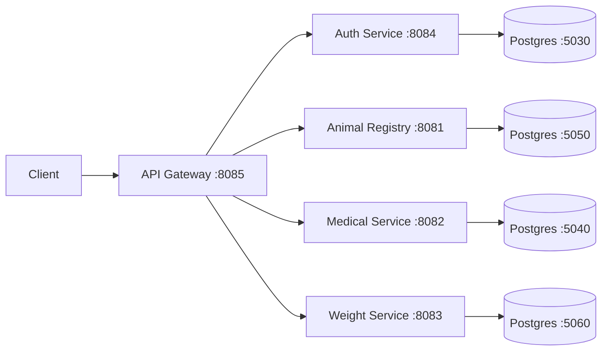

# Ranzo

[](./LICENSE)
[](https://github.com/owamani44/Ranzo/actions)
[](https://github.com/owamani44/Ranzo/releases)


Ranzo is a Java/Spring microservices backend for livestock management. It includes services for animal registry, medical events, weight records, authentication, and an API Gateway that routes external requests.

## Project Modules

- `api-gateway` (`:8085`): Entry point, request routing, JWT validation for protected routes.
- `authentication-service` (`:8084`): User registration, login, JWT issuance and token validation.
- `animal-registry-service` (`:8081`): Animal profile registration and lifecycle updates.
- `medical-service` (`:8082`): Health events and medication records.
- `weight-record-service` (`:8083`): Weight tracking and average daily gain updates.
- `integration-tests`: REST Assured + JUnit integration tests.
- `api-requests`: IntelliJ `.http` request collections.

## Tech Stack

- Java 25
- Spring Boot 4.x
- Spring Data JPA
- Spring Security + JWT (`jjwt`)
- Spring Cloud Gateway (WebFlux)
- PostgreSQL
- Maven (`mvnw` wrappers in services)
- Dockerfiles per service

## High-Level Architecture



## Prerequisites

- JDK 25 installed and active (`java -version`)
- Maven 3.9+ (for integration-tests) or use each service `./mvnw`
- PostgreSQL instances reachable on:
  - `localhost:5030` (auth)
  - `localhost:5040` (medical)
  - `localhost:5050` (animal)
  - `localhost:5060` (weight)
- Database credentials expected by services:
  - username: `admin_user`
  - password: `password`
  - database: `postgres`

## Environment and Configuration

### Service ports

- `animal-registry-service`: `8081`
- `medical-service`: `8082`
- `weight-record-service`: `8083`
- `authentication-service`: `8084`
- `api-gateway`: `8085`

### Gateway route URIs (override with env vars)

- `AUTH_SERVICE_URI` (default `http://localhost:8084`)
- `ANIMAL_SERVICE_URI` (default `http://localhost:8081`)
- `MEDICAL_SERVICE_URI` (default `http://localhost:8082`)
- `MEDICATION_SERVICE_URI` (default `http://localhost:8082`)
- `WEIGHT_SERVICE_URI` (default `http://localhost:8083`)
- `AUTH_SERVICE_URL` (used by JWT validation filter, default `http://localhost:8084`)

## Running Locally

Start services in this order:

1. `authentication-service`
2. `animal-registry-service`
3. `medical-service`
4. `weight-record-service`
5. `api-gateway`

Example commands:

```bash
cd authentication-service && ./mvnw spring-boot:run
cd animal-registry-service && ./mvnw spring-boot:run
cd medical-service && ./mvnw spring-boot:run
cd weight-record-service && ./mvnw spring-boot:run
cd api-gateway && ./mvnw spring-boot:run
```

## Authentication Flow

1. Register a user: `POST /auth/register`
2. Login: `POST /auth/login` to receive JWT token.
3. Send `Authorization: Bearer <token>` when calling protected gateway routes.
4. Gateway validates token by calling auth service `GET /auth/validate`.

## API Overview

### Through Gateway (`http://localhost:8085`)

- `POST /auth/register`
- `POST /auth/login`
- `GET /auth/validate`
- `GET|POST|PATCH|DELETE /api/animals/**` (JWT required)
- `GET|POST|DELETE /api/health-events/**`
- `GET|POST|DELETE /api/medication/**`
- `GET|POST|PATCH|DELETE /api/weight/**` 

### Service-native bases

- Animal: `/animals`
- Medical events: `/health-events`
- Medication: `/medication`
- Weight: `/weight`
- Auth: `/auth`

## Example Requests

Register user:

```http
POST http://localhost:8085/auth/register
Content-Type: application/json

{
  "firstName": "Eric",
  "lastName": "Kabendera",
  "password": "Password1234"
}
```

Login:

```http
POST http://localhost:8085/auth/login
Content-Type: application/json

{
  "username": "ekabendera",
  "password": "Password1234"
}
```

Get animals (via gateway, protected):

```http
GET http://localhost:8085/api/animals
Authorization: Bearer <JWT>
```

Record weight (service direct):

```http
POST http://localhost:8083/weight
Content-Type: application/json

{
  "tagNumber": "K01-001",
  "weight": 125,
  "medicalFollowUpRequired": false
}
```

## OpenAPI / Swagger UI

Available on services that include springdoc:

- Auth: `http://localhost:8084/swagger-ui/index.html`
- Animal: `http://localhost:8081/swagger-ui/index.html`
- Medical: `http://localhost:8082/swagger-ui/index.html`
- Weight: `http://localhost:8083/swagger-ui/index.html`

## Running Tests

Per service:

```bash
cd <service-folder>
./mvnw test
```

Integration tests:

```bash
cd integration-tests
mvn test
```

Integration tests expect running services reachable through gateway at `http://localhost:8085` and valid credentials for login.

## Docker

Each service contains a multi-stage Dockerfile.

Build example:

```bash
cd api-gateway
docker build -t ranzo/api-gateway:local .
```

Repeat for each service directory.

## Useful Repo Assets

- `api-requests/`: ready-made `.http` files for manual API testing.
- `integration-tests/src/test/java`: API-level integration test scenarios.

## Known Issues / Notes

- Several files in `api-requests/` use outdated ports/paths; prefer the routes documented in this README and service configs.
- Default credentials and JWT secret in `application.properties` are development-only values and should be externalized for production.
